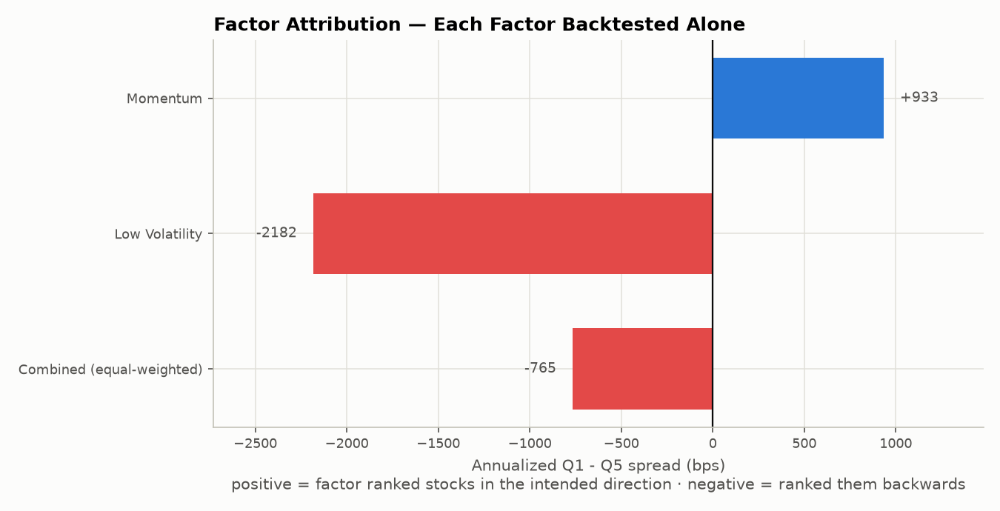
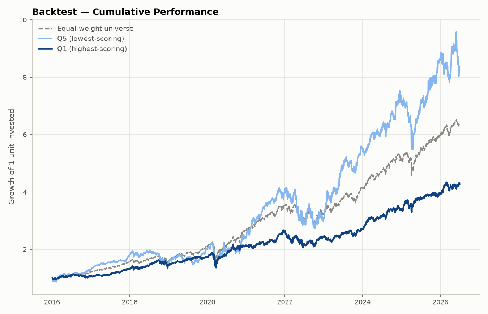
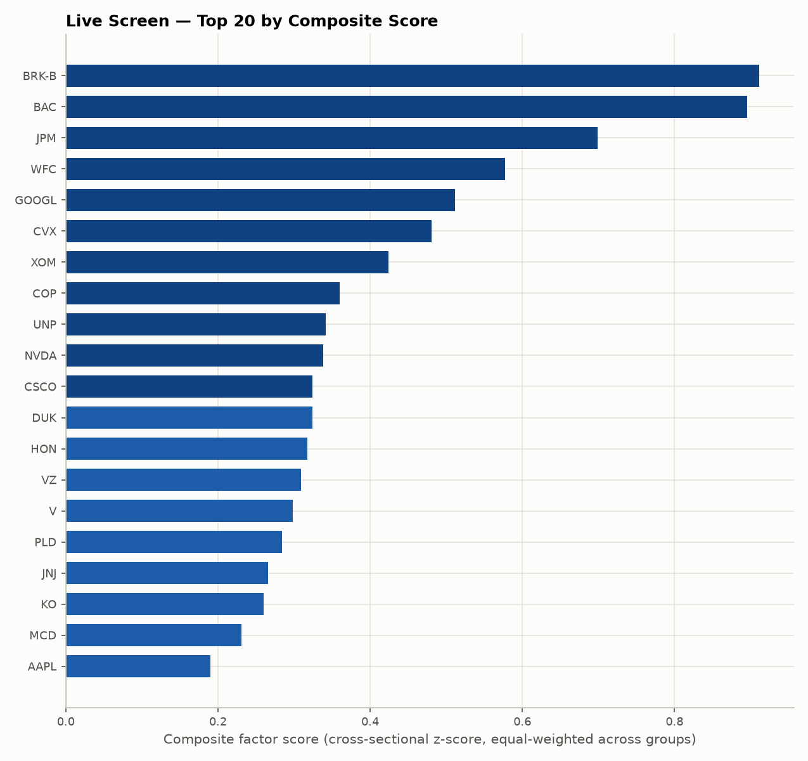
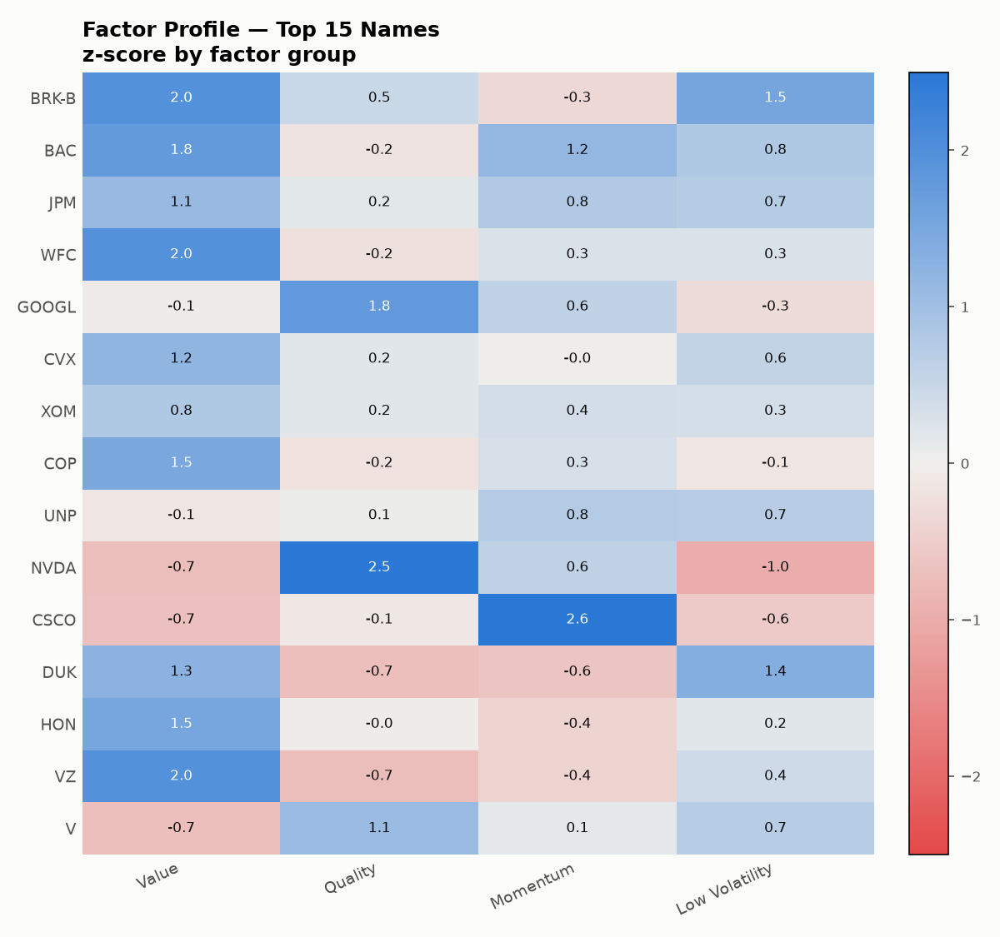
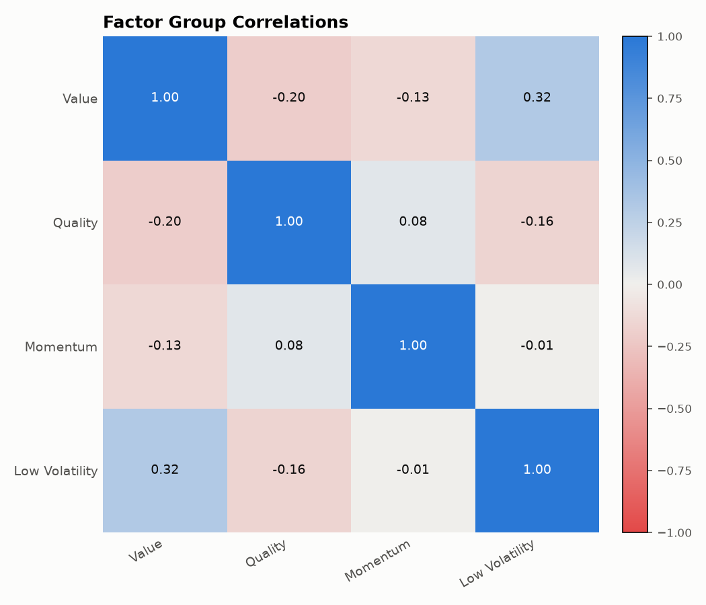
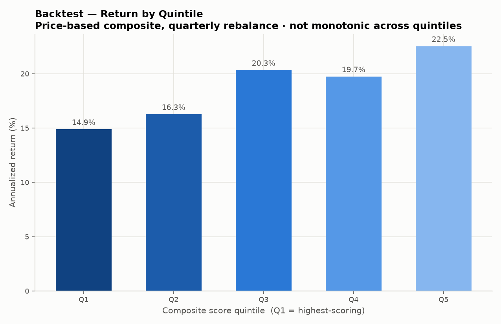

# Equity Factor Screener

A four-factor cross-sectional equity model — value, quality, momentum, and low volatility — scored across 53 S&P 500 constituents spanning all eleven GICS sectors, with the price-based half of the model validated through a point-in-time quintile backtest.

Built to complement two existing projects, a [fixed-income relative-value screener](https://github.com/bettuzzim/fixed-income-relative-value) and a [Markowitz portfolio optimizer](https://github.com/bettuzzim/portfolio-risk-allocation), closing the loop across the three core building blocks of asset allocation: fixed income, equity, and portfolio construction.

Every figure is recomputed from live data on each run, from two independent sources: Yahoo Finance for prices and fundamentals, FRED for the risk-free rate.

## The headline result

The combined price-based factor model **did not work** on this universe over 2016-2026. The backtest is reported as it came out, and the interesting part is what happens when the composite is taken apart:

| Factor (backtested alone) | Q1 return | Q5 return | Q1 - Q5 spread |
|---|---|---|---|
| Momentum | 23.37% | 14.05% | **+933 bps** |
| Low Volatility | 12.10% | 33.92% | **-2182 bps** |
| Combined (equal-weighted) | 14.88% | 22.53% | -765 bps |

*Equal-weight universe benchmark: 19.34% annualized, Sharpe 0.91.*

Momentum ranked stocks in the intended direction. Low volatility ranked them almost perfectly backwards, with enough magnitude to drag the blended composite negative — which is why an unattributed composite result would have been close to meaningless: two opposing effects partially cancelling look like noise.

The low-volatility reversal is not a bug, and checking that was the first thing worth doing. It is what the low-volatility anomaly does when it is applied to the wrong universe. The anomaly is documented on broad cross-sections including small and mid caps, over horizons containing genuine bear markets. This universe is 53 mega-caps over a decade in which the market's return was concentrated in high-beta mega-cap growth names. Screening for low volatility in that setting systematically avoided the stocks that produced the returns. The factor did not fail randomly; it failed for a reason visible in the data.

It is also worth stating that the momentum top quintile, despite the positive spread, produced a Sharpe of 0.86 against the equal-weighted universe's 0.91 — it earned more return by taking more risk, not by ranking better on a risk-adjusted basis.





**The factor weights were left alone after seeing this.** Setting low volatility's weight to zero would produce a composite that works, and it would be fitted on the same sample used to evaluate it — the in-sample illusion this kind of project exists to avoid. The weights stay equal; the attribution is reported next to them, which is the information a reader actually needs.

## Methodology

1. **Universe** — 53 large-cap S&P 500 constituents across all eleven GICS sectors, curated for reliable data coverage, with the as-of date recorded in `src/universe.py`.

2. **Factor construction** (`src/factors.py`) — every factor is oriented so higher is better:
   - **Value** — earnings yield, book-to-price, EBITDA/EV
   - **Quality** — return on equity, profit margin, and low leverage as 1/(1+D/E)
   - **Momentum** — 12-month and 6-month total return, each skipping the most recent month
   - **Low volatility** — negative trailing 12-month annualized realized volatility

   Value and leverage enter as *yields and reciprocals rather than negated ratios*. Price ratios are bounded below by zero with a long right tail, so a z-score of minus-P/E is driven almost entirely by the single most expensive name in the universe; their reciprocals are far better behaved. The momentum skip-month is not decoration either: equities show short-term reversal at the one-month horizon, a distinct and opposing effect, so including the most recent month mixes a reversal signal into a momentum factor.

3. **Standardization** (`src/scoring.py`) — raw values are winsorized against a robust centre and spread (median ± 3 rescaled MADs), z-scored cross-sectionally, then clipped at ±3. The order matters: an outlier contaminates the mean and standard deviation used to standardize every *other* stock, so clipping only after the fact leaves the damage already done.

   The *robust* bound is not interchangeable with a percentile one at this universe size, which is worth spelling out because the percentile version is the more natural first instinct and it fails silently. With 53 names, the 99th percentile is interpolated between the largest and second-largest observation, so the bound lands right next to the outlier it is meant to contain — a value 1000x out of scale gets clipped to roughly 900x out of scale, and the mean and standard deviation are contaminated regardless. This project used a 1st/99th percentile cut until a synthetic-data test showed it reducing the z-score spread across ten well-behaved observations to 0.003. Median and MAD have a 50% breakdown point, so the bound is set by the bulk of the distribution no matter how extreme the tail or how small the universe.

4. **Composite and ranking** — factor groups are averaged equal-weighted into a composite, and the universe is sorted into quintiles. Stocks scored on fewer than three of the four groups are left unranked rather than scored on thin evidence.

5. **Backtest** (`src/backtest.py`) — quarterly rebalancing, equal-weighted quintile portfolios held between rebalances so weights drift as they would in a real book, with factors recomputed at each date using only data available up to that date.

### Why the backtest uses only two of the four factors

Value and quality come from a fundamental snapshot describing the universe *as it is today*. Ranking 2017 on today's P/E would form a 2017 portfolio using information that did not exist until years later — look-ahead bias in its purest form, and the most common way a factor backtest produces a Sharpe ratio that cannot survive contact with reality.

Point-in-time fundamental history is a paid data product. It is not available here, so the backtest is restricted to momentum and low volatility, which are reconstructible at any past date from price history alone, and the four-factor model is presented as a live screen rather than a validated historical strategy. Running all four anyway and noting the caveat in small print would produce better-looking numbers and worse work.

## Data quality

Free fundamental data is noisy in specific, explainable ways, so `src/data_loader.py` applies plausibility bounds and reports what they caught. Three real examples from this universe:

- **BRK-B** reports a price-to-book of 0.00098, off by roughly three orders of magnitude (the true figure is near 1.6). Unchecked, that single corrupt field would have made Berkshire the cheapest stock in the universe by a wide margin.
- **JPM** returns no EV/EBITDA and no debt-to-equity. This is correct rather than missing: for a bank, leverage is raw material rather than capital structure, so those ratios carry no meaning and the provider omits them. Financials therefore score on fewer inputs by construction.
- **AAPL** reports a return on equity near 149%, which is genuine — years of buybacks have left very little book equity — but extreme enough to dominate a cross-sectional z-score if left uncapped.

The distinction the code draws is between the first case and the third: corrupt values become missing data, genuine extremes get winsorized. A typical run rejects values in 4 of the 6 fundamental fields and reports exactly which.

## Output

**Live screen — top names by composite score**



**Factor profile of the top names** — whether a high composite comes from one dominant exposure or broad strength. These are different bets, and the composite number alone hides which one you are making.



**Factor group correlations** — a diversification check. Pairwise correlations run between -0.18 and +0.31, so the four groups are carrying genuinely different information rather than one bet wearing four names.



**Quintile performance**



## Project structure

```
equity-factor-screener/
├── main.py                    # pipeline orchestration
├── app.py                     # Streamlit dashboard on the same pipeline
├── requirements.txt
├── src/
│   ├── universe.py            # ticker universe, sectors, as-of date
│   ├── data_loader.py         # prices, fundamentals, FRED risk-free rate, sanity bounds
│   ├── factors.py             # factor construction (point-in-time capable)
│   ├── scoring.py             # winsorization, z-scores, sector neutrality, composite
│   ├── backtest.py            # quintile backtest and per-factor attribution
│   └── viz.py                 # chart generation
└── outputs/                   # generated charts (created at runtime)
```

## Execution

```bash
pip install -r requirements.txt
python main.py
```

```bash
python main.py --sector-neutral    # score within sector where sample size allows
python main.py --top-n 25          # how many names to chart
streamlit run app.py               # interactive dashboard
```

Requires an internet connection. Individual ticker failures are handled without interrupting the run, and data coverage is reported rather than silently absorbed.

## Methodology notes and limitations

- **Survivorship bias.** The universe is today's constituents, so the backtest never holds a company that was delisted, acquired, or dropped from the index. This biases historical returns upward across every quintile — note that even the *bottom* quintile returned 22.5% annualized, which is not a plausible figure for genuinely weak stocks and is largely this bias showing through. Point-in-time index membership would be needed to remove it.
- **Sector-neutral scoring is available but not the default.** Comparing every stock against the whole universe means a value screen mostly returns banks and energy — visible in the current output, where the top four names are all financials. Scoring within sector removes that, but this universe carries 3-8 names per sector and a z-score over three observations is not a meaningful statistic. Sectors below the size threshold fall back to universe-wide scoring, and each run reports which ones did.
- **Simplified factor definitions.** These are practitioner-style approximations, not the full Fama-French/Carhart construction with double-sorted portfolios and additional controls.
- **No transaction costs.** Quarterly rebalancing of quintile portfolios would incur real costs, and the long/short leg assumes shorting is frictionless and always available. Neither holds.
- **One universe, one period.** A factor result on 53 mega-caps over a single decade is one observation, not evidence about factor premia in general. The low-volatility reversal documented above is a statement about this sample, not a refutation of the anomaly.
- **Not investment advice.** This demonstrates factor methodology on live data; it is not a portfolio recommendation.

## Tech stack

Python · pandas · numpy · scipy · yfinance · FRED (public CSV) · matplotlib · streamlit · plotly

## Author

Marco Bettuzzi
Economics and Statistics, University of Turin
[github.com/bettuzzim](https://github.com/bettuzzim)
